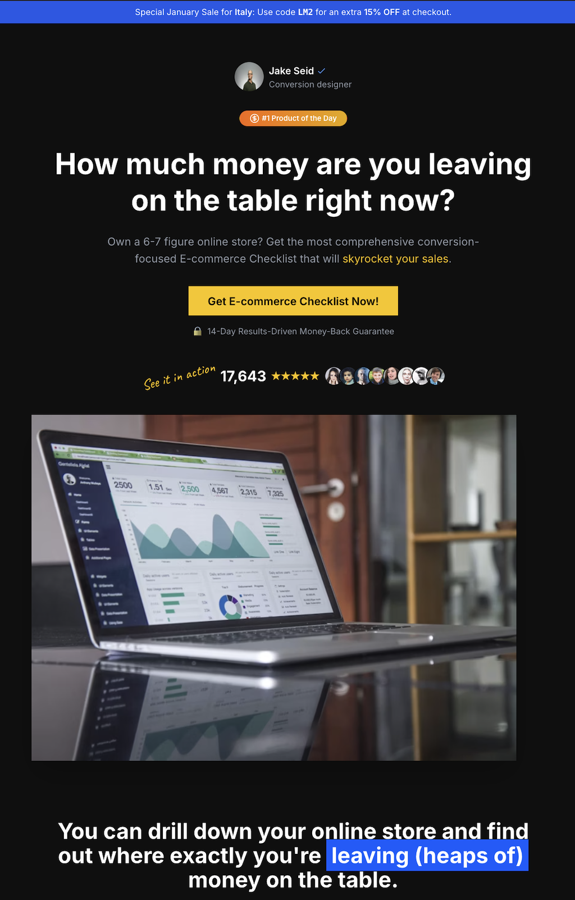

# Next.js Long Form Landing Page



## Description

This project uses **Next.js** to build a fast and scalable website, supporting the latest React standards. It is organized to keep development and maintenance straightforward, providing a solid base for additional integrations.

## Folder Structure

```
.
├── app/                          # Or pages/, depending on the Next.js version
│   ├── ...                       # Files for routing (e.g., layout, route handlers)
│   └── _app.js / _app.tsx        # Main application customization
├── components/                   # Shared components
│   └── ...                       # Component files
├── public/                       # Static files (images, favicon, etc.)
│   └── preview.png               # Preview image
├── styles/                       # Global styles or CSS modules
│   └── globals.css               # Global or base styles
├── .env.local                    # Environment variables (excluded from version control)
├── .gitignore                    # Git ignore file
├── next.config.js                # Next.js configuration
├── package.json                  # Project info and dependencies
├── README.md                     # This file
└── yarn.lock / package-lock.json # Package manager lock file (yarn or npm)
```

## Technical Requirements

- **Node.js 16+**  
- A package manager like **npm** or **yarn**  
- **Next.js** (version listed in `package.json`)

## Installation

1. **Clone the repository**:
   ```
   git clone <REPO_URL>
   cd repo-folder-name
   ```
2. **Install dependencies**:
   ```
   npm install
   # or
   yarn install
   ```
3. **Start the development server**:
   ```
   npm run dev
   # or
   yarn dev
   ```
   Go to [http://localhost:3000](http://localhost:3000) to view the app.

## Building and Running in Production

To create an optimized production build:
```
npm run build
```
Then to start the production server:
```
npm run start
```

## Environment Variables

For handling private keys or URLs, create a `.env.local` file in the project root and add your variables, for example:
```
NEXT_PUBLIC_API_URL=https://api.mysite.com
```
> Make sure not to commit the `.env.local` file to avoid exposing sensitive data.

## Additional Technical Details

- **Routing**: Handled automatically by Next.js. Each file in `app/` or `pages/` corresponds to a route.  
- **Styling**: Supports both CSS Modules or a framework like Tailwind CSS (if configured).  
- **API Routes**: You can build backend endpoints under `app/api/` or `pages/api/`.  
- **Deployment**: Easily deploy on [Vercel](https://vercel.com), [Netlify](https://www.netlify.com), or other Node.js platforms.

## Contributing

1. **Fork** the repository  
2. Create a branch for your feature: `git checkout -b feature/new-feature`  
3. Commit your changes with clear messages: `git commit -m "Add new feature"`  
4. Open a Pull Request for review

## License

This project is released under the **MIT License**, allowing free use, modification, and distribution.
